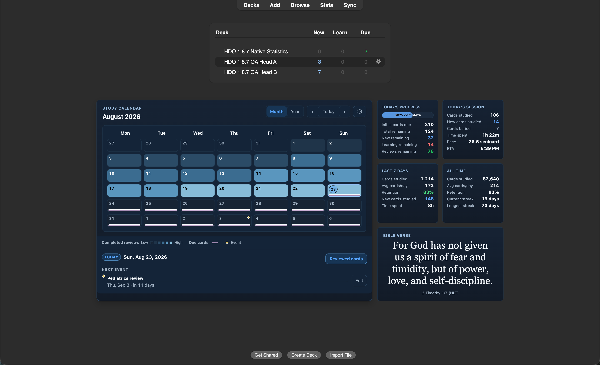
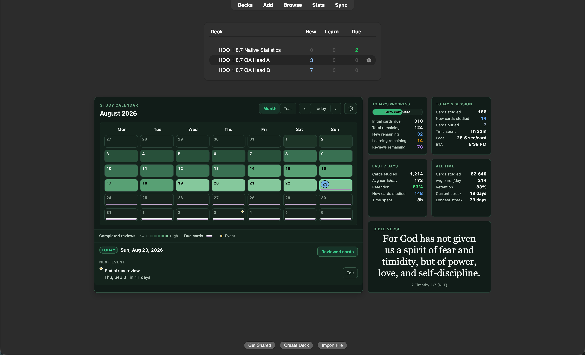
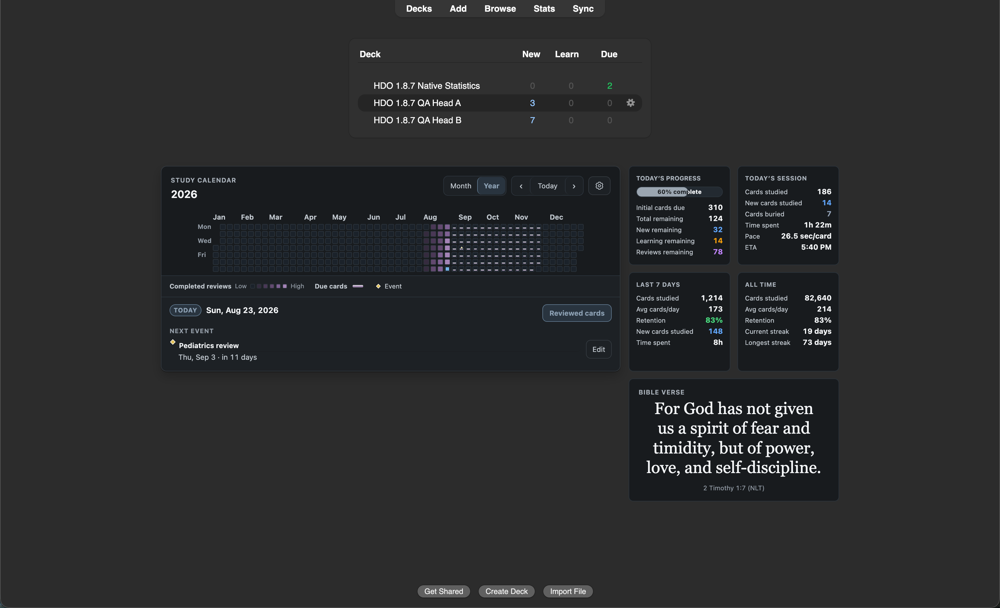
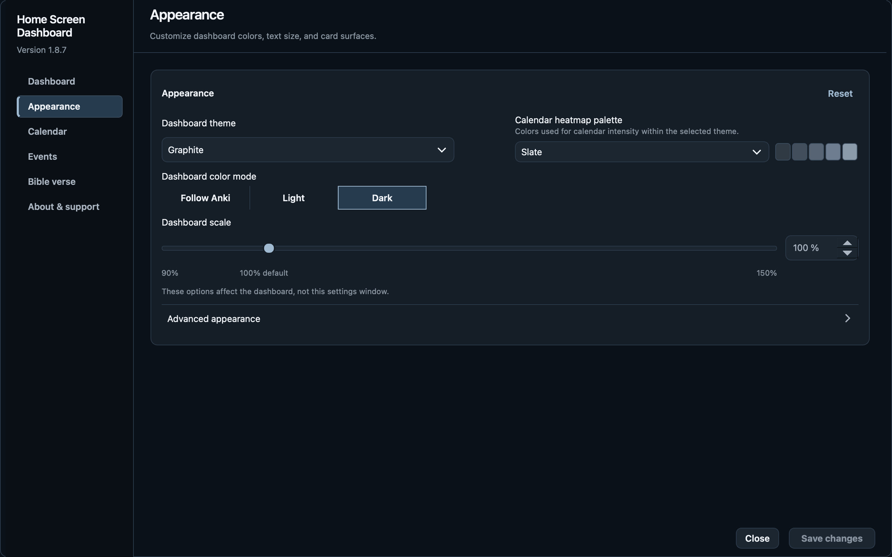
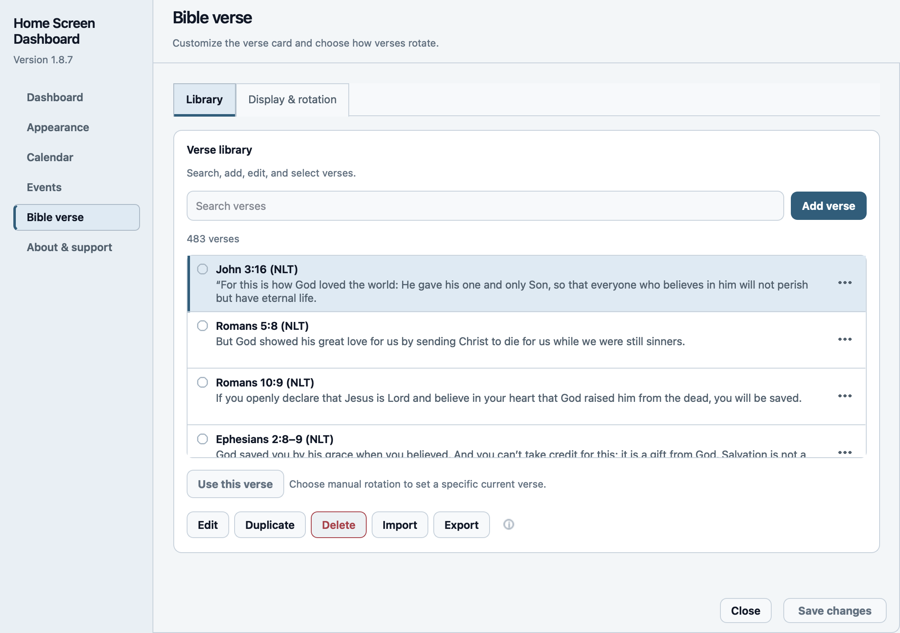

# Home Screen Dashboard

Home Screen Dashboard 1.8.7 is a calendar-first Deck Browser dashboard for
Anki Desktop 26.8. It combines study history, due work, local events, stable
metrics, and a rotating Bible verse without patching Anki's private Deck
Browser or statistics classes.

## At a glance

- See completed reviews, upcoming due cards, and local events in Month or Year.
- Follow today's progress alongside session, seven-day, and lifetime metrics.
- Choose from Sapphire Glass, Graphite, Emerald, and High Contrast themes with
  separate light and dark calendar palettes.
- Find controls in six Settings pages: Dashboard, Appearance, Calendar, Events,
  Bible verse, and About & support.
- Search and edit your verse library, preview typography and color, and choose
  daily, refresh-based, or manual rotation. The verse card is optional.
- Save changes when ready; discard a draft or retry a failed save without
  losing your edits.

## Screenshots

These native captures show the current 1.8.7 candidate with example study data.
Window title bars are cropped to keep the focus on the interface. Select an
image to view it at full size.

**Sapphire Glass · dark Month view**

[](docs/images/1.8.7/dashboard-sapphire-dark.png)

| Emerald · dark Month view | Graphite · Year overview |
| --- | --- |
| [](docs/images/1.8.7/dashboard-emerald-dark.png) | [](docs/images/1.8.7/dashboard-year.png) |

**Reorganized native Settings**

Appearance keeps theme, palette, and scale together. Bible verse opens to the
searchable Library, with Display & rotation in a separate view.

| Appearance · dark Settings | Bible library · light Settings |
| --- | --- |
| [](docs/images/1.8.7/settings-appearance-dark.png) | [](home_dashboard_overhaul/qa/release-evidence-1.8.7-2026-09-04-cf112634-ui-final/captures/SET-LIGHT-BIBLE.png) |

[Browse all 21 contact sheets](home_dashboard_overhaul/qa/release-evidence-1.8.7-2026-09-04-cf112634-ui-final/README.md)
or read the [UI refinement report](home_dashboard_overhaul/qa/UI_RELEASE_REFINEMENTS_2026-09-04.md).

<details>
<summary>Detailed 1.8.7 changes and implementation notes</summary>

### 1.8.7 highlights

- Settings remains a parented native `QDialog(mw)` with a local `exec()`
  lifetime. Its logical default is 1080×760, its normal minimum is 860×640,
  and it keeps 48 px normal screen margins or 24 px on a constrained screen.
- The UI-only `settings_dialog_geometry/v4` record stores logical geometry,
  screen identity, available bounds, and informational DPR. A valid v3 record
  migrates only when it meets the current minimum and remains at least 80%
  visible; disconnected, undersized, maximized, and full-screen records are
  rejected.
- The Caleb menu opens Settings directly and synchronously. Deck Browser
  bridge requests alone wait one coalesced event-loop turn so the callback can
  return first, and re-entry routes to the live modal dialog.
- Dashboard-specific workspace insertion, backing-view hiding, menu-dismissal
  timers, focus retries, focus restoration, and activation handling have been
  removed. Qt owns the window and focus lifecycle.
- Schema 8, all Settings fields, and the corrected scheduler and retention
  calculations remain unchanged.

- Every study-derived value now uses one collection-wide analytics scope.
  Today and historical facts use exact rollover-relative periods; New,
  Learning, Review, and Total remaining use each included top-level head's
  limited due tree without depending on the selected deck; and calendar due
  forecasting matches Anki's non-new, non-suspended future-due rules.
- Last 7 Days and All Time Retention now match Anki 26.8.1 native eligible
  retention instead of all-answer success. The visible Retention is rounded
  half-up once. Last 7 Days now displays Time spent from those same seven
  rollover-relative periods instead of displaying Again rate, and adds the
  half-up whole-card Avg cards/day across all seven periods. Both cards align
  Cards studied, Avg cards/day, and Retention in their first three rows.
- Remaining categories follow scheduler queues rather than card types: queue 0
  is New, queues 1/3/4 are Learning, and queue 2 is Review. Suspended and
  explicitly buried queues are excluded; Cards buried reports only scoped
  queues -2/-3 that are New or currently due/overdue. Future Learning and
  Review cards and transient queue-hidden siblings are excluded. While work
  remains, the progress bar displays `N% complete` inside the progress bar;
  Initial cards due exposes that same Cards studied plus Total remaining
  denominator above Total, New, Learning, and Reviews remaining.
- Initial HTML, live refresh, wide Month and Year 2×2 layouts, intermediate and
  narrow shells, and hard restart are contractually checked
  against identical values from the same collection snapshot.
- Settings uses a fixed header, vertically scrollable native page body, a
  reserved error region, and a separate fixed 56 px action footer. A centered
  shell capped at 1,264 px contains a 184 px sidebar and a page column capped
  at 1,080 px. The sidebar remains visible at the supported 860×640 minimum; constrained screens use a labelled section dropdown.
- Responsive Settings grids parent every field to its card before showing or
  filtering it. At 760 px of page content, Dashboard sections pair with Study
  metrics, Calendar display pairs with Calendar range, Bible Appearance pairs
  with Rotation, and About uses two deliberate columns. Appearance stays full
  width. The heatmap selector includes a five-step palette preview and Bible
  Appearance includes a compact live preview.
- Dashboard theme and Calendar heatmap palette share one responsive Appearance
  row.
  Their layout-changing staged updates run after the native combo popup closes,
  and save locking restores both the combo boxes and their nested popup views.

- Settings has six pages: **Dashboard**, **Appearance**, **Calendar**, **Events**,
  **Bible verse**, and **About & support**. Dashboard owns section visibility,
  panel placement, study preferences, and deck exclusions. Appearance owns
  theme, palette, scale, opacity, and blur. Calendar owns the view, week start,
  event markers, history range, and future due markers. A custom history cutoff
  also limits historical statistics and exact Browser targets.
- Events retains its searchable Active/Archived lists and staged editing.
  Editors place Name and Date, or Reference and Body, in reading order with
  fixed action buttons and a scrollable body when required.
- Bible verse opens to **Library**, which gives the list the available height
  and labels **Current** and **Pending save** rows. **Display & rotation** holds
  the typography, color, rotation controls, and a preview at the chosen size
  against the staged dashboard surface. Invalid colors block Save; contrast
  warnings remain optional. About groups support, privacy, and recovery.
- Dirty, saving, success, and discard feedback remains in the fixed action
  footer; validation and save failures use the reserved region above it.
  Failed saves retain the complete draft for lossless retry and expose
  technical details separately.
- Settings colors follow only Anki's live palette: light `#F3F6F8`/`#E9EFF4`
  surfaces with `#C7D1DB` borders and dark `#0B1118`/`#151D26` surfaces with
  `#2B3948` borders. Native controls use 34 px targets and the shared
  4/8/12/16/24 spacing scale at the canonical 100% application font.
- Month is a stable 42-cell grid and Year remains a true 53-week grid with
  fluid square cells and no internal horizontal scrolling. The centered
  dashboard is capped at 1,160 px with 16 px minimum side insets and a single
  30 px top margin. At 1,009 px it uses a 360 px insight rail; at 1,008 px and
  below the rail stacks, while the four summary cards remain 2×2 through
  589 px and become one column at 588 px. It measures Anki's visible bottom
  actions to maintain 24 px of clearance in normal document flow.
- All 16 existing completion-palette IDs now resolve to separately authored
  light and dark ladders while preserving each theme's saved selection.
  Sapphire Glass dark mode uses the audited red Learning and green Review
  semantic colors without changing the other theme baselines.
- Config and manual-verse persistence is transactional, with best-effort
  rollback and an inline error if only part of a save succeeds.
- Labels, ordering, whole-percent formatting, schema 8, existing metric/bridge
  keys, events, verses, migration behavior, and Anki's native navigation, deck
  table, gear, background, and bottom actions remain intact.

</details>

## Install

The local 1.8.7 candidate is built as
`home_dashboard_overhaul/dist/home-dashboard-overhaul-1.8.7.ankiaddon` for
installation through **Tools → Add-ons → Install from file**. The builder
writes the candidate checksum beside the archive. The frozen `cf112634…`
candidate includes the six-page Settings reorganization and dashboard
refinements. It passed the macOS Retina 100% native checks and automated
full-screen menu and Dashboard-gear workflows, including controlled restart.
It remains `review-required`, with independent human review still unrun.
Disable any legacy source add-ons named by the activation card.

The manifest supports Anki Desktop 26.8 (`min_point_version` and
`max_point_version` 260800).

## Getting started

1. Install the add-on and restart Anki. If an activation card names conflicting
   legacy add-ons, disable those entries first.
2. Switch between **Month** and **Year** and select a date to inspect its reviews,
   due cards, and events.
3. Open the calendar gear or **Caleb M. Add-ons Settings → Home Screen Dashboard settings** to
   customize the dashboard. Choose the relevant page, then **Save changes**.

| Settings page | What you can change |
| --- | --- |
| Dashboard | Visible sections, panel placement, study preferences, deck filters |
| Appearance | Dashboard theme, calendar palette, color mode, scale, opacity, blur |
| Calendar | Default view, week start, event markers, history and future due ranges |
| Events | Search, add, edit, archive, and restore local calendar events |
| Bible verse | Library entries, typography, color, rotation, and current manual verse |
| About & support | Version, diagnostics, documentation, privacy, and verse export |

Settings follows Anki's own light/dark appearance; dashboard colors are chosen
separately. A custom history cutoff also limits historical statistics and
related Browser targets. Export verse library edits from About & support
before updating or reinstalling. The add-on does not change cards or review
history.

## Build and minimal validation

Use Python 3.10 or newer:

```sh
python3 -m unittest home_dashboard_overhaul.tests.test_controller_insights home_dashboard_overhaul.tests.test_settings_release_contract -v
python3 -m unittest discover -s home_dashboard_overhaul/tests -v
node home_dashboard_overhaul/tests/calendar_model_test.js
python3 home_dashboard_overhaul/qa/capture_plan.py --json
python3 home_dashboard_overhaul/qa/validate_revised_ui_contract.py
python3 home_dashboard_overhaul/qa/validate_settings_window_contract_1_8_7.py
python3 home_dashboard_overhaul/tools/build_ankiaddon.py
python3 home_dashboard_overhaul/qa/performance_benchmark.py --compare home_dashboard_overhaul/qa/performance_baseline_1_8_7.json
```

The deterministic performance fixture uses 500,000 review rows and 50,000
cards. Dashboard refresh aggregates calendar counts and resolves exact Browser
card IDs only when a date is opened; it avoids transferring every card ID on
each refresh. The benchmark checks an absolute median below 500 ms and at least
a 40% improvement against the retained baseline.

The builder creates one 24-member allowlisted archive and verifies its version,
safe paths, current Settings contract, and source/archive byte parity. The
canonical 1.8.7 plan contains 116 native frames: 114 initial states and two
controlled-restart states. Its Settings profile contains 63 frames
at 100% application font, with no more than 14 contact sheets.
Each PNG must sample-match the live Settings client, and all 21 page captures
must include the complete decorated native Settings window; a same-sized
Dashboard background is a capture failure.
Settings acceptance also requires a structured exact-package native macOS
result proving that opening Settings from both the full-screen menu and the
Dashboard gear stays on Anki's full-screen Space without switching to the
desktop. Each route separately verifies all pages, Events tabs, resize, event
and verse edits, save, close/reopen, and controlled restart with current-Space
retention recorded for every step. This gate adds no canonical PNG captures;
the current bundle also retains eight supplemental Pending save/Current images.

The current 1.8.7 authorities are:

- [capture_plan.json](home_dashboard_overhaul/qa/capture_plan.json), the sole
  executable case, count, order, profile, and presentation authority
- [calendar_surface_manifest_1_8_7.json](home_dashboard_overhaul/qa/calendar_surface_manifest_1_8_7.json)
- [ui-surface-registry_1_8_7.json](home_dashboard_overhaul/qa/ui-surface-registry_1_8_7.json)
- [visual_regression_matrix_1_8_7.json](home_dashboard_overhaul/qa/visual_regression_matrix_1_8_7.json)
- [capture_evidence_manifest_1_8_7.json](home_dashboard_overhaul/qa/capture_evidence_manifest_1_8_7.json)
- [runtime_probe_release_1_8_7_manifest.json](home_dashboard_overhaul/qa/runtime_probe_release_1_8_7_manifest.json)
- [settings_window_contract_1_8_7.json](home_dashboard_overhaul/qa/settings_window_contract_1_8_7.json)

The [capture workflow](home_dashboard_overhaul/docs/qa/capture-workflow.md)
documents how to extend coverage, generate a named profile, run focused
diagnostic recaptures, and assemble fresh evidence from the shared plan.

The current [UI refinement report](home_dashboard_overhaul/qa/UI_RELEASE_REFINEMENTS_2026-09-04.md)
records the findings, implementation, and release decision. Its
[exact-package evidence](home_dashboard_overhaul/qa/release-evidence-1.8.7-2026-09-04-cf112634-ui-final/README.md)
is bound to candidate SHA-256
`cf11263491f2310aba3b4785f31596a33bd430f7fb320b7e0c64da7b091121c4`
and capture-plan SHA-256
`026d1bbd0190942e9faa161463aa4432a1f74000c8f0ac5848ac7d7de3ee0365`.
It retains 115 accepted native frames in 21 contact sheets, the exact
24-member archive, source/archive byte parity, restart persistence, and
isolation proof. One obstructed High Contrast Gold/light frame was omitted
at the user's request. An obstructed event-editor frame was replaced by an
existing verified capture from the identical package, scenario, and fixtures.
The [curation record](home_dashboard_overhaul/qa/release-evidence-1.8.7-2026-09-04-cf112634-ui-final/reports/visual-curation.json)
identifies both changes; the original runtime reports retain their 116-frame
automated results and do not constitute visual acceptance.

Automated checks and macOS full-screen menu and Dashboard-gear routes passed
before and after controlled restart. This evidence remains
`quality_status: review-required` and `release_ready: false` until an
independent human reviews the contact sheets and native interaction results.
VoiceOver, forced colors, reduced motion, Windows, Linux, DPR 1, alternate
application-font percentages, and alternate native OS display scaling remain
explicitly unrun, unclaimed, and nonblocking for 1.8.7. Packaged documentation
now describes the current Settings organization and behavior.

The [30 August evidence](home_dashboard_overhaul/qa/release-evidence-1.8.7-2026-08-30-4d0a4107-ui-readiness-100/README.md)
and newer 31 August spacing evidence remain intact as historical review inputs;
their earlier package hashes do not identify the current candidate.

## Project layout

- `home_dashboard_overhaul/`: packaged add-on source and documentation
- `home_dashboard_overhaul/tests/`: behavior and release-contract tests
- `home_dashboard_overhaul/qa/`: machine-readable contracts, QA tools, and
  versioned release evidence
- `deferred/calendar_sources_vnext/`: intentionally deferred external-calendar
  source excluded from 1.8.7

## License and notices

The add-on is licensed under AGPL-3.0-or-later. See
[LICENSE.txt](home_dashboard_overhaul/LICENSE.txt) and
[THIRD_PARTY_NOTICES.md](home_dashboard_overhaul/THIRD_PARTY_NOTICES.md).
