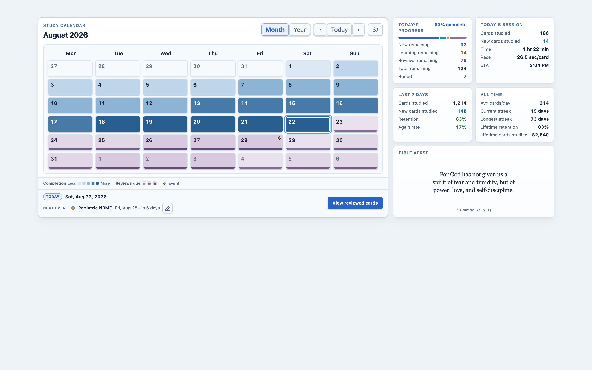

# Home Screen Dashboard

Home Screen Dashboard 1.8.0 is a calendar-first, responsive Deck Browser
dashboard for Anki Desktop 26.8. It combines study history, due work, local
events, progress metrics, and a rotating Bible verse without patching Anki's
private Deck Browser or statistics classes.



## Highlights

- A shared Month/Year calendar with explicit six-level completion heatmaps,
  five-level Reviews Due backgrounds and fixed-height markers, event diamonds,
  keyboard navigation, and collision-aware tooltips.
- An integrated footer with separate Completion, Reviews Due, and Event
  legends; selected-date context; the next event; and exact Reviewed, Due, or
  Most missed Browser actions only when applicable.
- Four metric cards—Today's Progress, Today's Session, Last 7 Days, and All
  Time—plus a rotating Bible verse in one persistent responsive insight rail.
- Four light/dark themes built from shared semantic roles. Study-state colors
  remain stable while theme accents, surfaces, and interaction treatments stay
  visually distinct.
- Staged responsive settings for dashboard appearance, study metrics, calendar
  data, local events, Bible verses, and support information.

At 940 CSS pixels and wider, Month and Year place the calendar beside a 2×2
metric rail and Bible card. From 440–939 pixels the rail moves below the
calendar while keeping two metric columns; narrower layouts use one column.

## Install

1. Download the verified
   [`home-dashboard-overhaul-1.8.0.ankiaddon`](home_dashboard_overhaul/qa/release-evidence-1.8.0-2026-08-23/package/home-dashboard-overhaul-1.8.0.ankiaddon).
2. In Anki, choose **Tools → Add-ons → Install from file**.
3. Restart Anki and disable any legacy source add-ons identified by the
   activation card.

The manifest supports Anki Desktop 26.8 (`min_point_version` and
`max_point_version` 260800).

## Settings and persistence

Open **Tools → Home Screen Dashboard settings** or use the calendar gear. The
four responsive pages are Dashboard, Events, Bible verse, and About & support.
Changes remain staged until **Save changes**. Configuration schema 6 removes
retired layout slots while preserving unrelated keys, local events, verse data,
saved themes, and supported preferences.

External calendar sources remain deferred and are not packaged. Buried-card
counts include scheduler-relevant queues -2 and -3, exclude suspended cards,
and remain outside the progress denominator.

## Build and test

Use Python 3.10 or newer:

```sh
python3 -m unittest discover -s home_dashboard_overhaul/tests -p 'test_*.py' -v
node home_dashboard_overhaul/tests/calendar_model_test.js
python3 home_dashboard_overhaul/qa/validate_revised_ui_contract.py
python3 home_dashboard_overhaul/qa/color_system_audit.py --output home_dashboard_overhaul/dist/color-audit
python3 home_dashboard_overhaul/tools/build_ankiaddon.py
```

The deterministic builder creates a 24-file allowlisted archive, rejects unsafe
paths, fixes timestamps, and verifies source/archive byte parity. Deferred
calendar modules, QA tools, generated evidence, and local user data stay outside
the package.

## Release validation

The final 1.8.0 archive SHA-256 is:

```text
84ce1ad81f888d18f856bef14b06759bae9631e5dc16da47338817ee391733e8
```

The retained
[`1.8.0 offline release evidence`](home_dashboard_overhaul/qa/release-evidence-1.8.0-2026-08-23/README.md)
contains the exact deterministic package, checksum, color-audit reports, and a
100%-scale visual reference/contact sheet. The release gate covers source,
tests, UI contracts, color contrast, package integrity, and source/archive
parity.

No Anki process or profile is launched for the 1.8.0 release gate. Live startup,
restart persistence, spoken VoiceOver, Windows/Linux rendering, forced-colors
behavior, and non-100% OS display scaling remain unverified and are not claimed.

The immutable 1.5.3 evidence remains available for historical comparison under
[`home_dashboard_overhaul/qa/live-ui-acceptance-1.5.3-release-2026-08-15/`](home_dashboard_overhaul/qa/live-ui-acceptance-1.5.3-release-2026-08-15/).

## Project layout

- `home_dashboard_overhaul/`: packaged add-on source and user documentation
- `home_dashboard_overhaul/tests/`: offline behavior and release-contract tests
- `home_dashboard_overhaul/qa/`: machine-readable contracts, QA tools, and
  retained release evidence
- `deferred/calendar_sources_vnext/`: intentionally deferred external-calendar
  source excluded from 1.8.0

## License and notices

The add-on is licensed under AGPL-3.0-or-later. See
[`home_dashboard_overhaul/LICENSE.txt`](home_dashboard_overhaul/LICENSE.txt) and
[`home_dashboard_overhaul/THIRD_PARTY_NOTICES.md`](home_dashboard_overhaul/THIRD_PARTY_NOTICES.md)
for the complete license, Scripture notice, and upstream acknowledgements.
