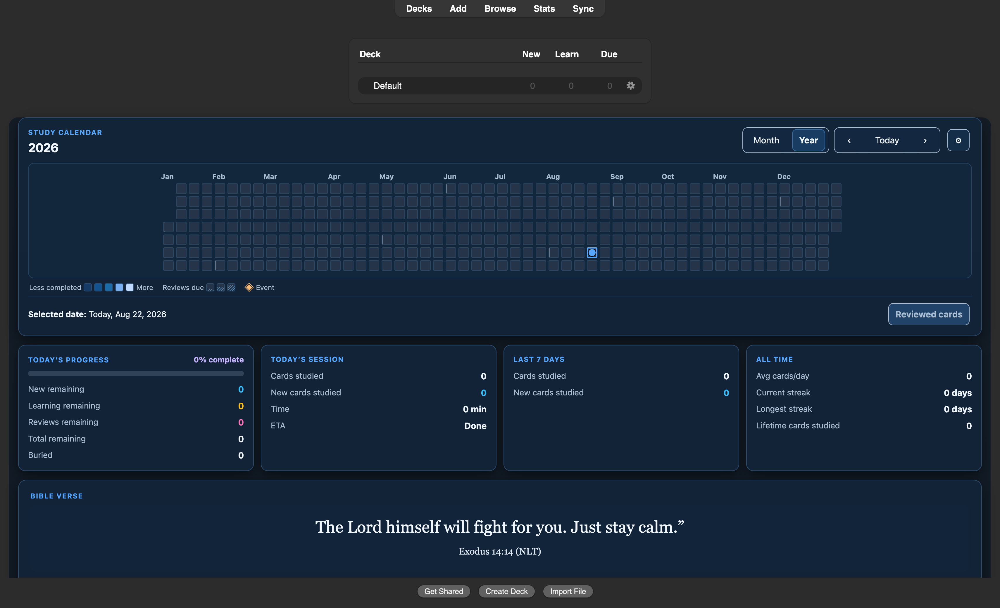

# Home Screen Dashboard

Home Screen Dashboard 1.7.0 is a calendar-first, responsive Deck Browser
dashboard for Anki Desktop 26.8. It combines study history, due work, local
events, progress metrics, and a rotating Bible verse without patching Anki's
private Deck Browser or statistics classes.



## What it includes

- A shared Month/Year study calendar with authored completion heatmaps, a quiet
  due-load band, event diamonds, keyboard navigation, and collision-aware
  tooltips.
- A compact context bar that distinguishes the selected date, an event on that
  date, and the globally calculated next event. Exact Reviewed or Due Browser
  actions remain visible for their date type and explain when no matching cards
  are available; Most missed appears only after an eligible Again answer.
- Four metric cards—Today’s Progress, Today’s Session, Last 7 Days, and All
  Time—followed by a full-width Bible verse.
- A count-derived four-segment workload bar for completed answers and remaining
  New, Learning, and Review cards. Buried cards remain outside that workload.
- Four dashboard themes and four independently saved completion palettes per
  theme, with light/dark variants and contrast-checked text colors.
- Local event creation, editing, archive/restore, deletion, and exact-event
  routing. External calendar sources remain deferred and are not packaged.

At 1,320 CSS pixels and wider, Month places the calendar beside a 2×2 metric
rail. Intermediate widths place the 2×2 metrics below the calendar; narrow
widths use one metric card per row. Year remains full width with square cells,
visible month labels, and horizontal scrolling before cells become too small.

## Settings and persistence

Open **Tools → Home Screen Dashboard settings** or use the calendar gear. The
responsive editor has four pages: Dashboard, Events, Bible verse, and About &
support. Dashboard settings are grouped into Appearance, Content & study
metrics, and Calendar & data.

Settings are staged until **Save changes**. The production renderer powers the
Dashboard and Bible previews, and schema 6 migration is idempotent: it removes
retired dashboard slots while preserving unrelated keys, events, verse data,
and supported preferences. The dashboard remains inactive while any of the five
legacy source add-ons is enabled, preventing duplicate panels and load-order
conflicts.

## Install

1. Download the verified
   [`home-dashboard-overhaul-1.7.0.ankiaddon`](home_dashboard_overhaul/qa/final-release-dashboard-overhaul-2026-08-22-2237/package/home-dashboard-overhaul-1.7.0.ankiaddon).
2. In Anki, open **Tools → Add-ons → Install from file** and choose the archive.
3. Restart Anki, then disable the legacy source add-ons if the activation card
   identifies any that are still enabled.

The release is pinned to Anki Desktop 26.8 (`min_point_version` and
`max_point_version` 260800).

## Build and test

Use Python 3.10 or newer for the zero-skip suite:

```sh
python3 -m unittest discover -s home_dashboard_overhaul/tests -p 'test_*.py' -v
node home_dashboard_overhaul/tests/calendar_model_test.js
python3 home_dashboard_overhaul/qa/validate_revised_ui_contract.py
python3 home_dashboard_overhaul/tools/build_ankiaddon.py
```

The deterministic builder writes an allowlisted archive to
`home_dashboard_overhaul/dist/`, verifies archive integrity and fixed
timestamps, and checks every packaged byte against the source tree. Deferred
calendar modules, vendored calendar dependencies, QA tools, and local user data
are excluded from the package.

## Release acceptance

The final 1.7.0 archive contains 24 allowlisted files and has SHA-256:

```text
3cdfc800de85eaa9fc59f1b06ab9169c517256299c9f174b5709c6bfbaa17ee6
```

Current offline validation passes 177 Python tests with Python 3.12, the
JavaScript calendar model, the 24-surface/28-criterion/96-case UI contract, and
a byte-identical deterministic rebuild. The retained
[`final-release-dashboard-overhaul-2026-08-22-2237`](home_dashboard_overhaul/qa/final-release-dashboard-overhaul-2026-08-22-2237/README.md)
bundle records a passing exact-package run in a fresh sync-disabled Anki 26.8.1
profile, eight live captures, and verified Month, Year, and responsive Settings
states. The release probe used only its disposable collection. A distinct
normal-profile Anki process was observed after the probe had exited; it was not
used for validation and was left untouched.

The companion
[`100% contact-sheet set`](home_dashboard_overhaul/qa/final-release-contact-sheets-100-percent-2026-08-22-2248/README.md)
retains 32 renderer captures across every theme, light/dark mode, Month/Year
view, and compact/wide layout, plus the exact-package dashboard and Settings
captures. Six full-resolution sheets preserve every source image at 1:1 scale.

The supplementary
[`native 100% contact-sheet set`](home_dashboard_overhaul/qa/final-release-contact-sheets-100-percent-2026-08-22-2317/README.md)
retains all 34 raw Qt/AnkiWebView captures from a fresh exact-package run, plus
five sheets covering the complete 32-case dashboard matrix and true full-screen
Month and Year.

Automated semantics, focus, keyboard, contrast, sizing, containment, and the
macOS Retina runtime passed. Spoken VoiceOver review and native Windows
high-DPI review remain separate human/platform gates and are not claimed.

The immutable 1.5.3 release evidence remains available for historical
comparison under
[`home_dashboard_overhaul/qa/live-ui-acceptance-1.5.3-release-2026-08-15/`](home_dashboard_overhaul/qa/live-ui-acceptance-1.5.3-release-2026-08-15/).

## Project layout

- `home_dashboard_overhaul/`: packaged add-on source and user documentation
- `home_dashboard_overhaul/tests/`: offline behavior and release-contract tests
- `home_dashboard_overhaul/qa/`: machine-readable contracts, capture tools, and
  retained release evidence
- `deferred/calendar_sources_vnext/`: source-only external-calendar work that is
  intentionally excluded from 1.7.0

## License and notices

The add-on is licensed under AGPL-3.0-or-later. See
[`home_dashboard_overhaul/LICENSE.txt`](home_dashboard_overhaul/LICENSE.txt) and
[`home_dashboard_overhaul/THIRD_PARTY_NOTICES.md`](home_dashboard_overhaul/THIRD_PARTY_NOTICES.md)
for the complete license, Scripture notice, and upstream acknowledgements.
