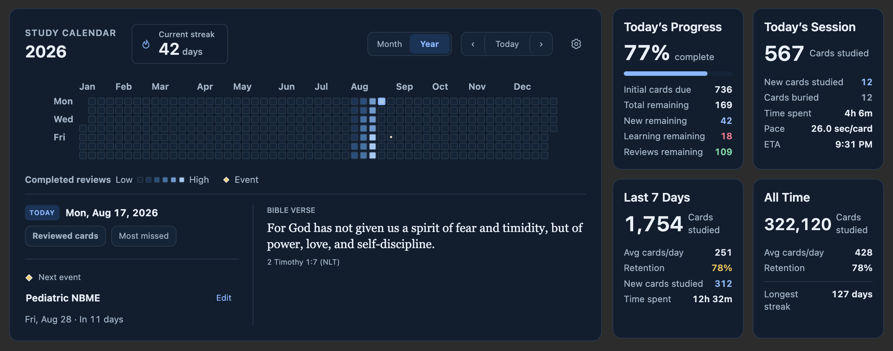
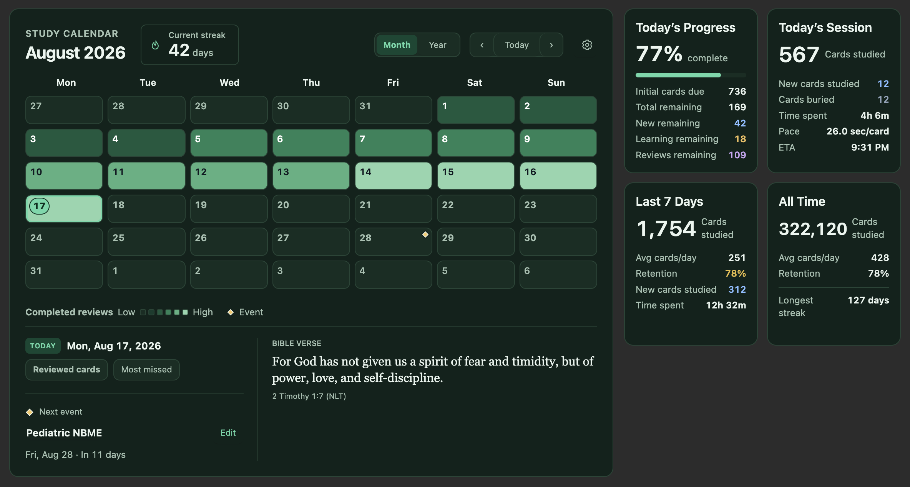
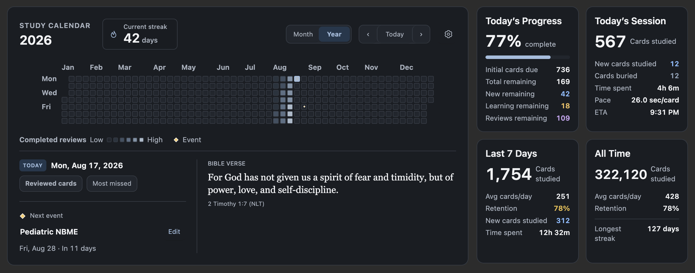

# Home Screen Dashboard

A study calendar, progress tracker, and statistics dashboard for Anki's home
screen.

**Version 1.9.0** · **Anki Desktop 26.8+**

## Features

- Browse your completed reviews and upcoming due cards in Month or Year view.
- Track today's progress, study time, retention, and streaks.
- Add local events and see what's coming up on your calendar.
- Customize themes, calendar colors, text size, and study preferences.
- Display a Bible verse from your own library with appearance settings.

## Screenshots

Click an image to view it at full size.

**Sapphire Glass · Year view**

| Emerald · dark Month view | Graphite · Year overview |
| --- | --- |
|  |  |

## Installation

1. In Anki, choose **Tools → Add-ons → Get Add-ons**.
2. Enter **808247776** and click **OK**.
3. Restart Anki.

[View on AnkiWeb](https://ankiweb.net/shared/info/808247776).
You can also download the [1.9.0 add-on file](https://github.com/caleblee789/Homescreen-Dashboard/releases/download/v1.9.0/home-dashboard-overhaul-1.9.0.ankiaddon)
and choose **Tools → Add-ons → Install from file**.

If the dashboard reports conflicting add-ons, disable the entries listed in
its message and restart Anki.

See [what changed in 1.9.0](home_dashboard_overhaul/CHANGELOG.md).

## Using the dashboard

Switch between **Month** and **Year**, then select a day to see its reviews,
due cards, and events.

Hover over a future date to check its due cards. To also mark them on the
calendar, turn on **Show future due indicators** in Calendar settings.

Open the calendar's gear icon or
**Caleb M. Add-ons Settings → Home Screen Dashboard settings** to customize it.
Choose a page, make your changes, and click **Save changes**.

| Settings page | What you'll find |
| --- | --- |
| Dashboard | Study preferences and deck filters |
| Appearance | Themes, calendar colors, text size, opacity, and blur |
| Calendar | Default view, week start, and history and due ranges |
| Events | Add, edit, search, archive, and restore events |
| Bible verse | Your verse library, text styling, and rotation options |
| About & support | Version information, diagnostics, help, and verse export |

Settings follows Anki's light or dark appearance. Dashboard colors can be
chosen separately.

## Help and backups

[Report a bug or request a feature](https://github.com/caleblee789/Homescreen-Dashboard/issues).
Include your Anki version and a screenshot when helpful.

Export your custom verse library from **About & support** before updating or
reinstalling. The add-on does not change your cards or review history.

## Development

See the [build and test instructions](home_dashboard_overhaul/README.md#build-and-validation),
[capture workflow](home_dashboard_overhaul/docs/qa/capture-workflow.md), and
[changelog](home_dashboard_overhaul/CHANGELOG.md) for technical details.

Unused external-calendar sources and their tests are preserved in the
[September 8 deferred snapshot](deferred/calendar_sources_vnext/snapshots/2026-09-08/README.md).
Historical references to `tests/test_calendar_repository.py` and
`tests/test_calendar_manager_model.py` now refer to that snapshot. Run its tests
separately using the documented runner; active add-on test discovery excludes them.

## License

[AGPL-3.0-or-later](home_dashboard_overhaul/LICENSE.txt) ·
[Third-party notices](home_dashboard_overhaul/THIRD_PARTY_NOTICES.md)
